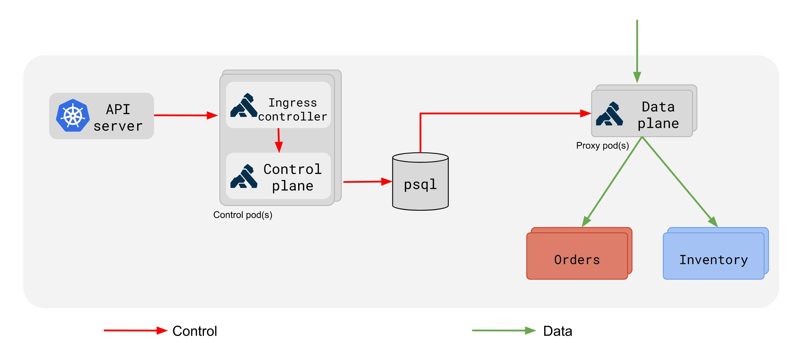
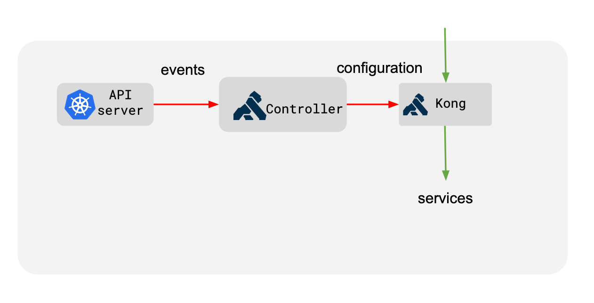
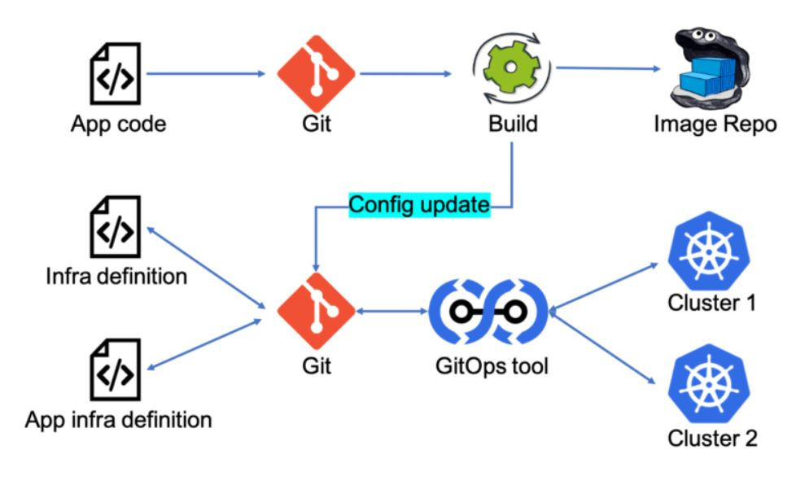

# API Gateway com Kong e Kubernetes

### Principais Conceitos

- Rotas
- Services
- Plugins
- Consumers
- Upstreams
- Targets

| Downstream | Proxy   | Upstream  |
| ---------- | ------- | --------- |
| Consumers  | Rotas   | Services  |
| -          | Plugins | Upstreams |
| -          | -       | Targets   |

### Kong e Kubernetes

**Kubernetes Ingress**
É a maneira de realizar a exposição de rotas HTTP e HTTPS para fora do cluster.
Este roteamento de tráfego é controlado por regras definidas dentro do recurso **Ingress** do Kubernetes.

**Tradução K*s -> Kong**
| Ingress rules | Kubernetes Service | Pods    |
| ------------- | ------------------ | ------- |
| Routes        | Service            | Targets |
| -             | Upstream           | -       |
| -             | -                  | -       |

### Deployments

**Usando banco de dados**


**DB-Less**


### Ferramentas necessárias
- Kind || minikube || microk8s
- kubectl
- Helm v3


**Criando clusters no Kind**
```bash
./infra/kong-k8s/kind/kind.sh
```

**Instalando Prometheus**
```bash
./infra/kong-k8s/misc/prometheus/prometheus.sh

> helm repo add prometheus-community https://prometheus-community.github.io/helm-charts

> helm repo update

> kubectl create ns monitoring

> helm install prometheus-stack prometheus-community/kube-prometheus-stack -f prometheus.yaml --namespace monitoring
```

**Instalando Keycloak**
```bash
./infra/kong-k8s/misc/keycloak/keycloak.sh

> helm repo add bitnami https://charts.bitnami.com/bitnami

> helm repo update

> kubectl create ns iam

> helm install keycloak bitnami/keycloak --set auth.adminUser=keycloak,auth.adminPassword=keycloak --namespace iam
```

**Instalando fluentd**
```bash

> helm repo add bitnami https://charts.bitnami.com/bitnami

> helm repo update

> kubectl create ns logs

> helm install fluentd bitnami/fluentd --namespace logs
```

**Instalando Kong**
```bash
./infra/kong-k8s/kong/kong.sh

> helm repo add kong https://charts.konghq.com

> helm repo update

> kubectl create ns kong

> helm install kong/kong --generate-name -f kong-conf.yaml --set proxy.type=NodePort,proxy.http.nodePort=30000,proxy.tls.nodePort=30003 --set ingressController.installCRDs=false --set serviceMonitor.enabled=true --set serviceMonitor.labels.release=promstack --namespace kong
```

**Instalando ConfigMaps, Deployments e HPA**
```bash
./infra/kong-k8s/misc/apps/
kubectl apply -f ./infra/kong-k8s/misc/apps/ --recursive -n bets
```

### Kong Custom Resource Definitions

**Rate Limit**
```bash
kubectl apply -f ./infra/kong-k8s/misc/apis/bets/kratelimit.yaml -n bets
```

**Plugin Prometheus**
```bash
kubectl apply -f ./infra/kong-k8s/misc/apis/bets/kprometheus.yaml
```

**Ingress**
```bash
kubectl apply -f ./infra/kong-k8s/misc/apis/bets/king.yaml -n bets
kubectl apply -f ./infra/kong-k8s/misc/apis/bets/bets-api.yaml -n bets
```

### Ver requisições no Kong
```bash
> kubectl get pods -n kong
NAME                                    READY   STATUS    RESTARTS     AGE
kong-1657034189-kong-5f7bf46587-87lvb   2/2     Running   1 (9h ago)   9h

> kubectl describe pod kong-1657034189-kong-5f7bf46587-87lvb -n kong
Containers:
  ingress-controller:
  .
  .
  proxy:


> kubectl logs kong-1657034189-kong-5f7bf46587-87lvb proxy -f -n kong
10.244.0.1 - - [06/Jul/2022:00:36:52 +0000] "POST /api/bets HTTP/1.1" 201 134 "-" "PostmanRuntime/7.29.0"
10.244.0.1 - - [06/Jul/2022:00:36:53 +0000] "POST /api/bets HTTP/1.1" 201 134 "-" "PostmanRuntime/7.29.0"
10.244.0.1 - - [06/Jul/2022:00:36:54 +0000] "POST /api/bets HTTP/1.1" 201 134 "-" "PostmanRuntime/7.29.0"

```

### Kong + OpenID Connect

Acessar keycloak fora do contexto do cluster K8S
```bash
kubectl port-forward svc/keycloak 8080:80 -n iam
```

1. Criar Client para o Kong
2. Criar User

**Configurar plugin**

Ativar validação do token através da chave pública
```yaml
bearer_only: "yes"
bearer_jwt_auth_enable: "yes"
```

```bash
kubectl apply -f ./infra/kong-k8s/misc/apis/bets/kopenid.yaml -n bets
```

**Ativar plugin no Ingress ./bets-api.yaml**
```yaml
konghq.com/plugins: oidc-bets
```

```bash
kubectl apply -f ./infra/kong-k8s/misc/apis/bets/bets-api.yaml -n bets
```

### Obter access_token
./infra/kong-k8s/misc/token/get-token.sh

### APIOps
É um conceito que aplica os solidos e testados princípios de DevOps e GitOps para o ciclo de vida das APIs e Microsserviços

### GitOps
É uma prática que usa Infraestrutura como código, que implica que um determinado ambiente (dev, homologação, prod) esteja criado em uma maneira declarativa através de manifestos, e que através de automação seja possível recriar o ambiente de maneira repetitiva.

Os manifestos devem estar armazenados dentro de um **repositório** git



### Ferramentas Necessárias
- Github Actions
- Spectral
- Postman
- ArgoCD

### ArgoCD - Install in K8S Cluster
```bash
kubectl create namespace argocd
kubectl apply -n argocd -f https://raw.githubusercontent.com/argoproj/argo-cd/stable/manifests/install.yaml
```

**Acessando ArgoCD**
```bash
kubectl -n argocd get secret argocd-initial-admin-secret -o jsonpath="{.data.password}" | base64 -d; echo

kubectl port-forward svc/argocd-server -n argocd 8080:443
```

**ArgoCD Apps**
.infra/argo-apps/

**Criar aplicações no ArgoCD**
```bash
kubectl apply -f infra/argo-apps/players.yaml -n argocd
```

### Iniciando com testes de carga

**K6 and testkube**
https://k6.io/open-source/
https://testkube.kubeshop.io/

Installing testkube
```bash
./load/infra/install.sh

> wget -qO - https://repo.testkube.io/key.pub | sudo apt-key add -
> echo "deb https://repo.testkube.io/linux linux main" | sudo tee -a /etc/apt/sources.list
> sudo apt-get update
> sudo apt-get install -y testkube

> kubectl testkube install
```

**Preparando cluster para obter metricas**

Installing Metrics Server
https://kubernetes-sigs.github.io/metrics-server/

O Metrics Server coleta métricas de recursos do Kubelets e as expõe no apiserver Kubernetes por meio da API Metrics para uso pelo Horizontal Pod Autoscaler e Vertical Pod Autoscaler.

Você pode usar o Metrics Server para: 
- Escalonamento automático horizontal baseado em CPU/memória.
- Ajustar/sugerir automaticamente os recursos necessários para os contêineres.

```bash
infra/kong-k8s/kind/metrics-server/metrics-server.sh

> helm repo add metrics-server https://kubernetes-sigs.github.io/metrics-server/
> helm upgrade --install metrics-server metrics-server/metrics-server --namespace kube-system --set args={--kubelet-insecure-tls}
```

**Importante:** Aplicar Autoscaling nos deployments das apps
```bash
kubectl apply -f ./infra/kong-k8s/misc/apps/hpa/ --recursive -n bets
```

**Instalar prometheus para obter metricas de API**

```bash
> helm list -A
NAME            	NAMESPACE  	REVISION	UPDATED                                	STATUS  	CHART                       	APP VERSION
prometheus-stack	monitoring 	1       	2022-07-17 19:42:44.299475826 -0300 -03	deployed	kube-prometheus-stack-37.2.0	0.57.0
```

```bash
> helm delete prometheus-stack -n monitoring
release "prometheus-stack" uninstalled
```

**Importante:** Parametros importantes para ativar a coleta de métrica no Kong
./infra/kong-k8s/kong/kong.sh
```bash
--set serviceMonitor.enabled=true --set serviceMonitor.labels.release=promstack
```

**Importante:** Ativar plugin do prometheus no Ingress

### Aplicando cargas

**Validar se o service monitor esta ativo no kong**

```bash
> kubectl get servicemonitor -n kong
No resources found in default namespace.
```
Se não existir o servicemonitor instalado deve-se instalar o prometheus antes do kong.

**Port Forward no Grafana**
```bash
kubectl port-forward svc/prometheus-stack-grafana 3000:80 -n monitoring
user: admin
pass: prom-operator
```

Dashboard Kong/Grafana: **7424**

**Load**
./load/infra/load.sh
```bash
> kubectl testkube create test --file ../create_bet_load.js --type k6/script --name create-bet-load
Test created testkube / create-bet-load 🥇

> kubectl testkube run test create-bet-load -f
```

**Delete teste Testekube**
```bash
kubectl testkube delete test create-bet-load
```

**Validando testes de carga**
```bash
> kubectl get pods -n testkube
NAME                                                    READY   STATUS      RESTARTS        AGE
62e87c3150720970feb1725a-h7cn2                          1/1     Running     0               35s

> kubectl logs 62e87c3150720970feb1725a-h7cn2 -n testkube
{"type":"line","content":"\nrunning (1m00.0s), 4/5 VUs, 524220 complete and 0 interrupted iterations\ndefault   [  19% ] 4/5 VUs  1m00.0s/5m10.0s\n"}
{"type":"line","content":"\nrunning (1m01.0s), 4/5 VUs, 543313 complete and 0 interrupted iterations\ndefault   [  20% ] 4/5 VUs  1m01.0s/5m10.0s\n"}
{"type":"line","content":"\nrunning (1m02.0s), 4/5 VUs, 563273 complete and 0 interrupted iterations\ndefault   [  20% ] 4/5 VUs  1m02.0s/5m10.0s\n"}
```